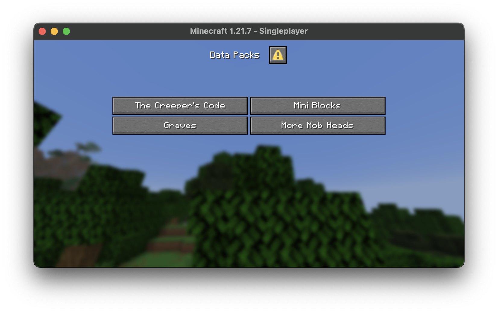
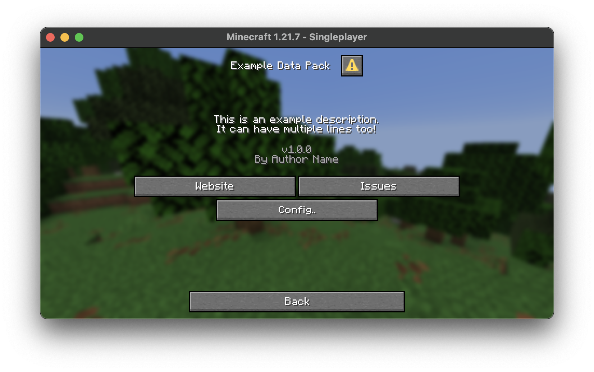

---
myst:
  substitutions:
    summary: "A data pack menu to display installed data packs on the pause screen"
    required: "For all data packs willing to include an about dialog"
    example: "Vanilla Tweaks dialog included in the smithed dialog tag describing itself"
---

# {{new_bdg}} Data Pack Menu Dialog
{{ convention_header }}

```{warning}
This convention is using the ✨ experimental ✨ [dialogs](https://minecraft.wiki/w/Dialog) from **Minecraft 1.21.6**. This means single player worlds that open a data pack using this convention will display the experimental warning. Additionally, any changes to loaded dialogs while a world is being played (either during development or users loading new data packs and `/reload`ing) will **not** reload dialogs instead requiring world / server restarts.

Considering these caveat, you may *not* want to implement this convention until this feature is stabilized. If you already use experimental features, there's not much change in behavior using this convention.
```

This convention adds a data pack menu to the `#minecraft:pause_screen_additions` [dialog](https://minecraft.wiki/w/Dialog) tag which provides an interface for data packs to describe themselves, link to external resources, and provide sub-menus for configuration or options. The main scope of this convention is to provide a central location for data packs to display their information in a consistent manner, similar to the "Mod Menu" experience found in many modded Minecraft clients.

Packs using this convention will be including a small set of files (akin to the [`yellow_shulker_box.json`](/guides/yellow-shulker-box) file and the [Lantern Load](https://github.com/lanternmc/load) convention). This will be available as a library but also can be easily copy pasted into your pack.



## Usage

First, you'll need to bundle some files with your data pack. These will be available as a library on Smithed but you can also directly copy these files into your pack. These are just tag definitions alongside the official smithed dialog file that will be used to display the data pack menu.

Then, you'll want to make your own data pack dialog file. This dialog should be placed in the `#smithed:data_packs` dialog tag like so:

```json
{
  "values": [
    {
      "id": "namespace:about",
      "required": false
    }
  ]
}
```

```{attention}
Since the dialogs (loaded via a data pack) use the experimental registry system, if a data pack is added to a running world and a player runs `/reload`, the world's data packs will break. To avoid this from happening, you **must** include a `"required": false` field in the dialog tag entry.
```

The dialog located at `namespace:about` can then be designed as you see fit. While the exact contents of this dialog are specific to your pack, it's highly recommended to include something similar to the following:



This dialog above includes the pack's name alongside a short description of the pack, the pack's author and version, and some buttons that link to external websites or other sub-menus (such as for configuration). You can choose what details are important or relevant to your pack (if any at all).

```{important}
Dialogs can also specify exit actions that occur when using {kbd}`ESC` or clicking the `Back` button. To keep a sense of continuity among dialogs, it's highly recommended to use a specific `exit_action` that redirects to the main data pack menu dialog. This can be done by specifying the `exit_action` field in the dialog definition like so:

```json
{
  "exit_action": {
    "action": {
      "type": "show_dialog",
      "dialog": "smithed:data_packs"
    },
    "label": {
      "translate": "gui.back"
    },
    "width": 200
  }
}
```

## Appendix

:::::{tab-set}
::::{tab-item} Root Dialog

`data/smithed/dialog/data_packs.json`
```json
{
  "type": "minecraft:dialog_list",
  "external_title": {
    "translate": "menu.smithed.data_packs",
    "fallback": "%s...",
    "with": [
      {
        "translate": "selectWorld.dataPacks"
      }
    ]
  },
  "title": {
    "translate": "menu.smithed.data_packs.title",
    "fallback": "%s",
    "with": [
      {
        "translate": "selectWorld.dataPacks"
      }
    ]
  },
  "dialogs": "#smithed:data_packs",
  "exit_action": {
    "label": {
      "translate": "gui.back"
    },
    "width": 200
  }
}
```

::::

::::{tab-item} Pause Screen Tag

`data/minecraft/tags/dialogs/pause_screen_additions.json`
```json
{
  "values": [
    {
      "id": "smithed:data_packs",
      "required": false
    }
  ]
}
```

::::

::::{tab-item} Data Packs Tag

`data/smithed/tags/dialogs/data_packs.json`
```json
{
  "values": [
    {
      "id": "namespace:about",
      "required": false
    }
  ]
}
```

::::

::::{tab-item} Example Dialog

`data/namespace/dialog/about.json`
```json
{
  "type": "minecraft:multi_action",
  "title": "Example Data Pack",
  "body": [
    {
      "type": "minecraft:plain_message",
      "contents": "This is an example description.\nIt can have multiple lines too!",
      "width": 300
    },
    {
      "type": "minecraft:plain_message",
      "contents": {
        "text": "v1.0.0\nBy Author Name",
        "color": "gray"
      },
      "width": 300
    }
  ],
  "actions": [
    {
      "label": "Website",
      "action": {
        "type": "open_url",
        "url": "https://example.com/"
      }
    },
    {
      "label": "Issues",
      "action": {
        "type": "open_url",
        "url": "https://github.com/example/test/issues"
      }
    },
    {
      "label": "Config..",
      "action": {
        "type": "minecraft:run_command",
        "command": "function example:config"
      }
    }
  ],
  "exit_action": {
    "action": {
      "type": "show_dialog",
      "dialog": "smithed:data_packs"
    },
    "label": {
      "translate": "gui.back"
    },
    "width": 200
  }
}
```

::::
:::::
